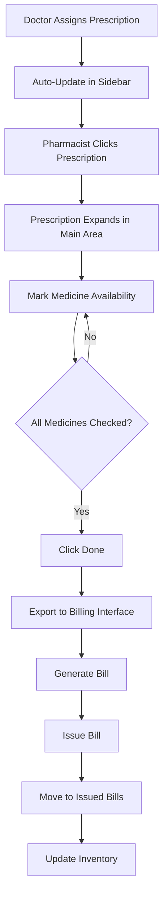
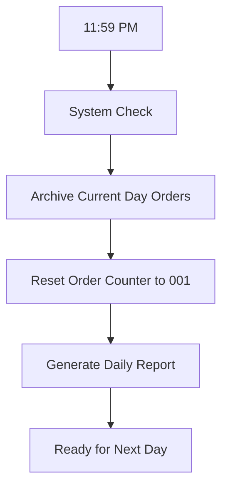

# Pharmacy Dashboard UI Specification

## 📋 Overview
This document outlines the comprehensive UI design and functionality requirements for the HealthMate Pharmacy Dashboard. The system is designed to streamline prescription management, inventory tracking, and billing processes for pharmacies.

---

## 🎯 Core Features

### 1. Order Management System
- **Current Order Number Display**: Prominent box showing active order number
- **Auto-Reset**: Order number resets to 001 at midnight daily
- **Order Status Tracking**: Visual indicators for different order states

### 2. Prescription Management
- **Real-time Updates**: Automatic prescription updates from doctor assignments
- **Sidebar Navigation**: Quick access to pending prescriptions
- **Expandable View**: Full prescription details on click
- **Medicine Availability Marking**: Individual or bulk availability setting

### 3. Billing System
- **Automated Bill Generation**: Export available medicines to billing interface
- **Bill Issuance**: One-click bill generation and delivery
- **Bill Archive**: Comprehensive issued bills section with search/filter

### 4. Inventory Management
- **Real-time Updates**: Automatic quantity adjustments based on issued medicines
- **Stock Monitoring**: Low stock alerts and notifications
- **Inventory Overview**: Comprehensive medicine catalog with quantities

---

## 🖼️ UI Layout Structure

### Main Dashboard Layout
```
┌─────────────────────────────────────────────────────────────┐
│ Header: HealthMate Pharmacy | Order #XXX | [Profile] [⚙️]   │
├─────────────────┬───────────────────────────────────────────┤
│ Sidebar (25%)   │ Main Content Area (75%)                   │
│                 │                                           │
│ 📋 Prescriptions│ ┌─ Current Order Display ─┐               │
│ • New (3)       │ │ Order #042               │               │
│ • Processing(1) │ │ Started: 2:30 PM         │               │
│ • Completed(5)  │ │ Items: 0                 │               │
│                 │ └─────────────────────────┘               │
│ 💊 Inventory    │                                           │
│ • All Items     │ [Selected Prescription Details Area]      │
│ • Low Stock     │                                           │
│ • Expired       │                                           │
│                 │                                           │
│ 🧾 Billing      │                                           │
│ • Current Bill  │                                           │
│ • Issued Bills  │                                           │
│ • Reports       │                                           │
└─────────────────┴───────────────────────────────────────────┘
```

---

## 🔄 User Flow Diagrams

### Prescription Processing Flow


### Daily Order Reset Flow


---

## 🎨 Detailed UI Components

### 1. Header Section
- **Logo & Title**: HealthMate Pharmacy branding
- **Order Number Box**: Large, prominent display of current order
- **Time Display**: Current time and date
- **User Profile**: Quick access to settings and logout
- **Notifications**: Bell icon with unread count

### 2. Sidebar Navigation
#### Prescriptions Section
- **New Prescriptions** (Badge with count)
  - Red indicator for urgent prescriptions
  - Green indicator for regular prescriptions
- **Processing** (Badge with count)
- **Completed Today** (Badge with count)
- **Search Bar**: Quick prescription search

#### Inventory Section
- **All Items**: Complete medicine catalog
- **Low Stock** (Badge with count - Red if critical)
- **Expired/Expiring** (Badge with count)
- **Add New Item**: Quick inventory addition

#### Billing Section
- **Current Bill**: Active billing session
- **Issued Bills**: Searchable archive
- **Daily Reports**: Sales and inventory reports
- **Payment Methods**: Configure accepted payments

### 3. Main Content Area

#### Current Order Display Box
```
┌─ Current Order #XXX ─────────────────┐
│ Started: 2:30 PM                     │
│ Items in Cart: 5                     │
│ Total Value: $125.50                 │
│ Status: Processing                   │
│ ──────────────────────────────       │
│ [View Cart] [Generate Bill]          │
└──────────────────────────────────────┘
```

#### Prescription Detail Expansion
```
┌─ Prescription Details ─────────────────────────────────────────┐
│ Patient: John Doe | Age: 45 | Contact: +1234567890            │
│ Doctor: Dr. Sarah Wilson | Date: Sep 24, 2025                 │
│ ────────────────────────────────────────────────────────────── │
│                                                                │
│ Medicines Prescribed:                                          │
│                                                                │
│ ┌─ Medicine 1 ─────────────────────────────────────────────┐   │
│ │ 💊 Amoxicillin 500mg                                    │   │
│ │ Quantity: 21 tablets | Dosage: 1 tablet 3x daily       │   │
│ │ Instructions: Take with food                            │   │
│ │ ─────────────────────────────────────                   │   │
│ │ Stock: 150 available ✅                                 │   │
│ │ [✅ Available] [❌ Not Available] [⚠️ Partial: ___]      │   │
│ │ Price: $15.00 | Insurance: Covered                     │   │
│ └─────────────────────────────────────────────────────────┘   │
│                                                                │
│ ┌─ Medicine 2 ─────────────────────────────────────────────┐   │
│ │ 💊 Ibuprofen 400mg                                      │   │
│ │ Quantity: 30 tablets | Dosage: 1 tablet 2x daily       │   │
│ │ Instructions: Take after meals                          │   │
│ │ ─────────────────────────────────────                   │   │
│ │ Stock: 5 available ⚠️ (Low Stock)                       │   │
│ │ [✅ Available] [❌ Not Available] [⚠️ Partial: ___]      │   │
│ │ Price: $8.50 | Insurance: Not Covered                  │   │
│ └─────────────────────────────────────────────────────────┘   │
│                                                                │
│ ──────────────────────────────────────────────────────────── │
│ [Mark All Available] [Mark All Unavailable] [Done ✅]         │
└────────────────────────────────────────────────────────────────┘
```

#### Billing Interface
```
┌─ Billing Interface - Order #XXX ──────────────────────────────┐
│                                                                │
│ Available Medicines:                                           │
│ ┌────────────────────────────────────────────────────────────┐ │
│ │ Item                    | Qty | Unit Price | Total         │ │
│ │ Amoxicillin 500mg      │ 21  │ $0.71      │ $15.00        │ │
│ │ Ibuprofen 400mg        │ 30  │ $0.28      │ $8.50         │ │
│ │ ────────────────────────│─────│────────────│───────────────│ │
│ │                        │     │ Subtotal:  │ $23.50        │ │
│ │                        │     │ Tax (8%):  │ $1.88         │ │
│ │                        │     │ Total:     │ $25.38        │ │
│ └────────────────────────────────────────────────────────────┘ │
│                                                                │
│ Payment Method: [Cash ▼] [Credit Card] [Insurance]            │
│ Insurance Info: [Covered Items: $15.00] [Patient Pays: $10.38]│
│                                                                │
│ Customer Info:                                                 │
│ Name: John Doe | Phone: +1234567890 | Email: john@email.com   │
│                                                                │
│ ──────────────────────────────────────────────────────────── │
│ [Print Receipt] [Email Receipt] [Issue Bill ✅]               │
└────────────────────────────────────────────────────────────────┘
```

---

## 💾 Data Management

### Real-time Updates
- **Prescription Updates**: WebSocket connection for instant prescription updates
- **Inventory Sync**: Automatic quantity adjustments on bill issuance
- **Order Tracking**: Live status updates across all connected devices

### Data Storage Structure
```
prescriptions/
├── pending/
│   ├── {prescriptionId}/
│   │   ├── patientInfo
│   │   ├── doctorInfo
│   │   ├── medicines[]
│   │   ├── status
│   │   └── timestamp
├── processing/
└── completed/

inventory/
├── {medicineId}/
│   ├── name
│   ├── category
│   ├── quantity
│   ├── unitPrice
│   ├── expiryDate
│   ├── batchNumber
│   └── supplier

bills/
├── issued/
│   ├── {billId}/
│   │   ├── orderNumber
│   │   ├── items[]
│   │   ├── totalAmount
│   │   ├── paymentMethod
│   │   ├── timestamp
│   │   └── customerInfo
└── daily_reports/
```

---

## 🔔 Additional Essential Features

### 1. Notification System
- **New Prescription Alerts**: Sound + visual notification
- **Low Stock Warnings**: Daily inventory alerts
- **System Updates**: Maintenance and update notifications
- **Payment Confirmations**: Successful transaction alerts

### 2. Search & Filter Capabilities
- **Prescription Search**: By patient name, doctor, or medicine
- **Inventory Search**: By medicine name, category, or batch
- **Bill History Search**: By date range, amount, or customer
- **Advanced Filters**: Multiple criteria combinations

### 3. Reporting Dashboard
- **Daily Sales Report**: Revenue, items sold, popular medicines
- **Inventory Reports**: Stock levels, expiry tracking, reorder suggestions
- **Monthly Analytics**: Trends, growth metrics, efficiency stats
- **Custom Reports**: User-defined parameters and export options

### 4. Emergency Features
- **Emergency Medicine Lookup**: Quick access to critical medicines
- **Doctor Contact Directory**: Quick communication with prescribing doctors
- **Backup System**: Offline mode for internet connectivity issues
- **Emergency Contacts**: Quick access to suppliers and medical contacts

### 5. Customer Management
- **Customer Profiles**: Purchase history and preferences
- **Loyalty Program**: Points and rewards tracking
- **Insurance Integration**: Real-time coverage verification
- **Prescription History**: Complete medication timeline per customer

### 6. Security Features
- **User Authentication**: Role-based access control
- **Data Encryption**: Secure patient and financial data
- **Audit Trail**: Complete action logging for compliance
- **Backup & Recovery**: Automated data protection

---

## 📱 Mobile Responsiveness

### Tablet View (768px - 1024px)
- Condensed sidebar with collapsible sections
- Optimized prescription detail cards
- Touch-friendly buttons and controls

### Mobile View (< 768px)
- Bottom navigation bar
- Full-screen prescription details
- Swipe gestures for quick actions
- Simplified billing interface

---

## 🛠️ Development Plan

### Phase 1: Core Infrastructure (Week 1-2)
#### Backend Development
- [ ] Set up Firebase collections for prescriptions, inventory, and bills
- [ ] Create real-time listeners for prescription updates
- [ ] Implement order number generation and reset logic
- [ ] Design inventory management APIs

#### Basic UI Framework
- [ ] Create main dashboard layout structure
- [ ] Implement sidebar navigation
- [ ] Set up responsive grid system
- [ ] Design component library (buttons, cards, forms)

### Phase 2: Prescription Management (Week 3-4)
#### Prescription Handling
- [ ] Build prescription sidebar with real-time updates
- [ ] Create expandable prescription detail view
- [ ] Implement medicine availability marking system
- [ ] Add batch availability tracking (full/partial/unavailable)

#### Data Integration
- [ ] Connect with doctor prescription assignment system
- [ ] Implement prescription status workflows
- [ ] Add prescription search and filter functionality
- [ ] Create prescription archive system

### Phase 3: Billing System (Week 5-6)
#### Billing Interface
- [ ] Build billing interface with cart functionality
- [ ] Implement price calculation with tax and discounts
- [ ] Add multiple payment method support
- [ ] Create receipt generation (print/email)

#### Bill Management
- [ ] Design issued bills archive with search
- [ ] Implement daily/monthly sales reports
- [ ] Add bill modification and refund capabilities
- [ ] Create customer billing history

### Phase 4: Inventory Management (Week 7-8)
#### Real-time Inventory
- [ ] Build inventory dashboard with stock levels
- [ ] Implement automatic quantity updates on sales
- [ ] Create low stock alert system
- [ ] Add expiry date tracking and warnings

#### Inventory Operations
- [ ] Design medicine addition/editing interface
- [ ] Implement batch number and supplier tracking
- [ ] Add inventory import/export functionality
- [ ] Create reorder suggestion system

### Phase 5: Advanced Features (Week 9-10)
#### Notification System
- [ ] Implement real-time push notifications
- [ ] Add email/SMS notification capabilities
- [ ] Create notification preferences panel
- [ ] Build notification history and management

#### Analytics & Reports
- [ ] Design analytics dashboard with charts
- [ ] Implement custom report generation
- [ ] Add data export functionality (PDF/Excel)
- [ ] Create performance metrics tracking

### Phase 6: Testing & Optimization (Week 11-12)
#### Quality Assurance
- [ ] Comprehensive UI/UX testing across devices
- [ ] Performance optimization for large datasets
- [ ] Security testing and vulnerability assessment
- [ ] User acceptance testing with pharmacy staff

#### Deployment Preparation
- [ ] Production environment setup
- [ ] Documentation and user training materials
- [ ] Backup and disaster recovery procedures
- [ ] Go-live support and monitoring

---

## 🧪 Testing Strategy

### Unit Testing
- Individual component functionality
- Data validation and error handling
- Business logic verification

### Integration Testing
- Real-time data synchronization
- Cross-component communication
- Third-party service integration

### User Testing
- Pharmacy workflow simulation
- Performance under load
- Mobile device compatibility
- Accessibility compliance

---

## 📊 Success Metrics

### Operational Efficiency
- **Order Processing Time**: Target < 3 minutes per prescription
- **Inventory Accuracy**: 99%+ stock level accuracy
- **Bill Generation Speed**: < 30 seconds from completion to issued

### User Experience
- **Learning Curve**: New users productive within 2 hours
- **Error Rate**: < 1% user-induced errors
- **User Satisfaction**: 4.5+ stars average rating

### Business Impact
- **Revenue Tracking**: 100% accurate sales reporting
- **Inventory Optimization**: 20% reduction in overstock
- **Customer Satisfaction**: Faster service and accurate billing

---

## 🔮 Future Enhancements

### AI Integration
- **Demand Forecasting**: Predict medicine requirements
- **Price Optimization**: Dynamic pricing suggestions
- **Customer Insights**: Behavioral analytics

### Advanced Integrations
- **Insurance API**: Real-time coverage verification
- **Supplier Integration**: Automated reordering
- **Government Reporting**: Compliance automation

### Mobile App
- **Customer App**: Prescription tracking and delivery
- **Pharmacist Mobile**: On-the-go inventory management
- **Delivery Integration**: Third-party delivery services

---

This comprehensive specification provides a solid foundation for developing a modern, efficient pharmacy management system that streamlines operations while maintaining high standards of accuracy and customer service.